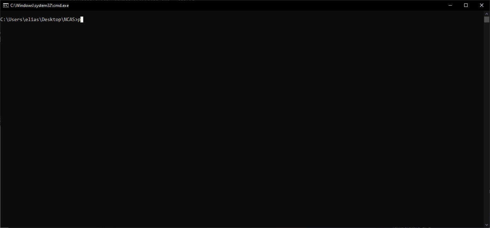

# NCAS

NCAS (Netsh Command Automation Script) is a Python3 script who shows saved WiFi passwords registered in Windows. It is based on netsh.

#### Translation

NCAS has a [French](fr/README_fr.md) version in the "fr" folder.
The both version work regardless the language installed on Windows.

## Features

- Show passwords of each point access whose the computer was connected.
- Can export one or more Wi-Fi profile:
  - in .xml (format is used for the importation)
  - in .txt
  - in .xlms (excel format)
- Can import one or more Wi-Fi profile.
- Have a interactive interface.
- Can delete Wi-Fi profile.
- Can list SSIDs
- Can list the wireless network interfaces



## Installation

NCAS has a portable version, you can just download and launch ncas.exe.
If the program closed the first time, please reopen it a second time.

### Python version installation

```python
  cd ncas-master
  pip install -r requirements
  python ncas.py --config
  python ncas.py
```

#### Dependencies

If you want install the dependencies manually:

- terminaltables
- pandas
- colorama

## Tested on
<table>
    <tr>
        <th>Operative system</th>
    </tr>
    <tr>
        <td>Windows 10</td>
    </tr>
    <tr>
        <td>Windows 11</td>
    </tr>
</tr>
</table>

#### Credits
The executable version has been made with [auto-py-to-exe](https://github.com/brentvollebregt/auto-py-to-exe)

